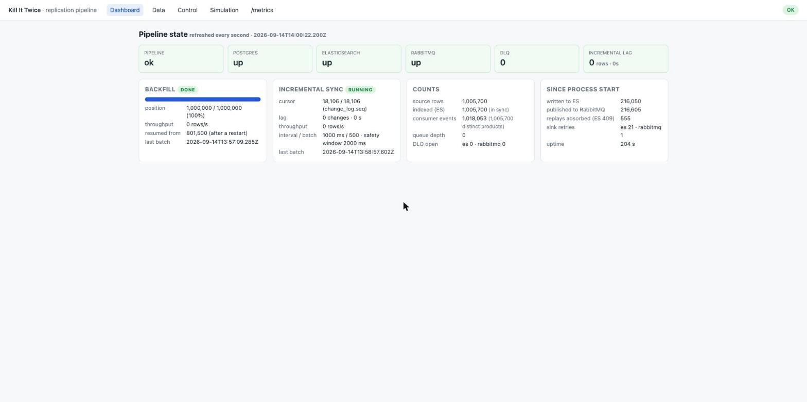
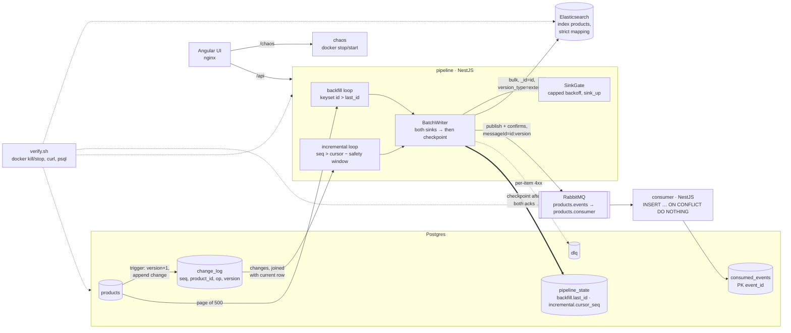

# Kill It Twice — a replication pipeline that is built to be killed

Postgres → pipeline → **Elasticsearch** (searchable current state) and **RabbitMQ** (change stream with an
independent consumer). Backfill and incremental sync run at the same time. The process can be killed at any
moment, a sink can disappear for a minute, a record can be garbage — and `make verify` proves what happens.

```
$ make verify        # 1,000,000 rows, 174 s on a laptop (12 CPU / 8 GB Docker)
G1 resume after kill .............. PASS (killed at 306,000 / resumed at 306,000; killed at 608,000 / resumed at 608,000; killed at 801,500 / resumed at 801,500; 0 lost)
G2 no duplicates .................. PASS (1,000,000 source / 1,000,000 es / 1,000,000 consumer / 0 dupes; replays absorbed: es 500, consumer 1,500)
G3 sink outage .................... PASS (60s down, 0 lost, recovered in 4.3s, cpu 0.9%, 0.30 retries/s)
G4 partial batch failure .......... PASS (497 written, 3 in DLQ, 3 replayed after fix)
G5 observability .................. PASS (metrics+health+logs+ui answer position/throughput/lag/DLQ/health)
```

Full log of that run: [`docs/verify-report.txt`](docs/verify-report.txt) (summary) and `verify/out/*.log` after you run it.

| Document | What it is |
|----------|-----------|
| [`SPEC.md`](SPEC.md) | The brief the code was built from. Committed before any code (`git log --follow SPEC.md`, tag `spec-v1`), revised as reality pushed back (v2, v3). |
| [`AGENTS.md`](AGENTS.md) | How to work in this repo: layout, conventions, what not to touch, how to check your own work. |
| this file | How to run it, architecture, ADRs, guarantee, capacity, what was cut, where the AI deviated from the spec. |

---

## 1. Running it

Prerequisites: Docker Desktop (give it ≥ 6 GB RAM; Elasticsearch alone takes 2 GB), `make`, `curl`, `jq`, `perl`
(present on macOS/Linux). Nothing else — Node 20+ is only needed for `make test` (unit tests run outside Docker).

```bash
make up          # docker compose up -d --build   (postgres, elasticsearch, rabbitmq, pipeline, consumer, chaos, ui)
make seed        # 1,000,000 rows (SEED_ROWS=200000 make seed for a quick loop) — resets sinks, checkpoints, DLQ
make verify      # the five gates; exit code 1 if any FAIL
make test        # unit tests (pipeline + consumer)
make logs        # pipeline + consumer logs (JSON lines)
make clean       # down + delete volumes
```

| What | Where |
|------|-------|
| UI | http://localhost:4200 |
| Pipeline API / metrics / health | http://localhost:3000/api/status · /metrics · /health |
| Consumer API / metrics | http://localhost:3001/api/stats · /metrics |
| RabbitMQ management | http://localhost:15672 (guest / guest) |
| Elasticsearch | http://localhost:9200 |
| Postgres | localhost:5432 (`app`/`app`, db `replication`; set `PG_PORT` in `.env` if 5432 is taken) |

Tunables (`.env`, see `.env.example`): `BATCH_SIZE` (500), `INCREMENTAL_INTERVAL_MS` (1000), `SAFETY_WINDOW_MS`
(2000), `RETRY_MAX_MS` (5000). Batch size and interval can also be changed at runtime from the UI.



---

## 2. Architecture



**One batch, start to finish**

1. Read 500 rows (backfill: `id > last_id` up to the snapshot `target_max_id`; incremental: `change_log.seq > cursor`,
   joined with the *current* row so several changes to one row collapse into its latest version).
2. Write to both sinks **concurrently**: ES `_bulk` with `_id = id`, `version = products.version`,
   `version_type = external`; RabbitMQ publish on a confirm channel, one message per row, `messageId = "id:version"`.
3. A sink that is unavailable is retried on its own with capped backoff (500 ms → 5 s, jitter) while the other
   sink's result is kept. `sink_up{sink}` goes to 0 and `pipeline_state` to 1 (degraded) meanwhile.
4. ES bulk items are classified one by one: 2xx written · 409 already-applied (replay/stale, counted) ·
   429/5xx retried · other 4xx → **DLQ row** with payload, error, batch id, mode. The other 497 stand.
5. Only now the checkpoint is written (`pipeline_state.last_id` or `cursor_seq`).

Crash anywhere before step 5 ⇒ the batch is re-read on restart and both sinks absorb the repeat.
Full failure matrix: [SPEC §5](SPEC.md#5-delivery-guarantee).

---

## 3. Delivery guarantee — declared

**At-least-once delivery, effectively-once effect.**

- The pipeline may deliver a record more than once (after a crash between sink ack and checkpoint, or after a
  sink timeout where the write actually landed). It never delivers less than once: nothing is checkpointed
  before both sinks acknowledged it, and nothing is dropped on a sink error — a data-rejected record goes to the DLQ.
- Both sinks are idempotent on `(product_id, version)`, where `version` is a per-row counter bumped by a
  trigger (not a timestamp — clocks collide and are not monotonic):
  - Elasticsearch: external versioning — a replayed or stale write returns 409 and is counted in
    `duplicates_absorbed_total{sink="es"}`; the document is never downgraded.
  - Consumer: `consumed_events.event_id` (`"id:version"`) is the primary key; `ON CONFLICT DO NOTHING`;
    repeats are counted in the consumer's `duplicates_absorbed_total`.
- Ordering between backfill and incremental does not matter: an old backfill snapshot arriving after a newer
  incremental write is a 409 no-op.

What this is **not**: exactly-once delivery. There is no distributed transaction across Postgres, ES and
RabbitMQ, and I did not want to fake one (ADR-3).

---

## 4. Why 1,000,000 rows

The task says the volume must make "load everything in memory" impossible and make the gates meaningful.

- A row is ~410 bytes as JSON (`_source`), so 1M rows ≈ **410 MB of JSON in flight**, 400 MB on disk in Postgres,
  260 MB in the index, 870 MB in the consumer's event table (it keeps the payload). The pipeline container
  runs at ~170 MB RSS: it never holds more than one batch per loop. A naive `SELECT *` into memory would need
  gigabytes with JS object overhead.
- 1M rows / 500 = **2,000 batches**, i.e. 2,000 checkpoints and 2,000 windows in which a kill can land. At
  ~17k rows/s the backfill takes ~60 s, long enough to kill it three times at chosen positions and short enough
  that the whole verify fits in three minutes and a reviewer will actually run it.
- The source, the index, the event table and the checkpoint all have to be *counted* by the verify script
  (`count(*)`, `_count`, `count(distinct …)`, `sum(version)` on both sides). At 1M rows these are sub-second;
  at 10M they would dominate the verify time without proving more.
- `SEED_ROWS` makes it a dial; the gates are the same at 200k and 1M (both were run).

---

## 5. Gates — what verify.sh actually does

| Gate | The failure it causes | What it asserts | Result |
|------|----------------------|-----------------|--------|
| **G1** | `docker kill -s SIGKILL pipeline` at 30 % and 60 % of the backfill; `crash-after-next-batch` (exit(1) after both sink acks, before the checkpoint) at 80 %; `docker compose start` each time | `backfill_resume_from_id` (the position the new process resumed from) **equals** `pipeline_state.last_id` read from Postgres at the moment of death, and is > 0; a `backfill_resumed` log line exists; after completion `count(products) == _count(index)` and `sum(version)` is equal on both sides (no doc missing, none stale) | PASS |
| **G2** | same run (three restarts) | `1,000,000 = source = index = consumer rows = distinct products`; `count(*) − count(distinct event_id) = 0`; `duplicates_absorbed_total > 0` on **both** sinks — i.e. replays really happened and were really absorbed, the counts are not equal by luck | PASS |
| **G3** | `docker stop elasticsearch` for 60 s while a generator updates/inserts/soft-deletes ~300 rows/s; `docker start` | during the outage: pipeline CPU (5 `docker stats` samples) avg < 15 %, `sink_retry_total{es}` grows < 1/s, `sink_up{es} = 0`; after: time from "ES answers `_cluster/health`" to `sink_up{es} = 1`; lag drains to 0; `sum(version)` and counts equal on both sides | PASS — cpu 0.9 %, 0.30 retries/s, recovered in 4.3 s |
| **G4** | 3 rows get `attributes.weight_kg = "not-a-number"`, then 500 rows (the 3 included) are touched | the index accepted 497 (version sums equal for ids 4–500), the 3 are in `dlq` with payload + error + batch_id, `dlq_size{es} = 3`, the 3 documents are still at their previous version (not lost, not downgraded); then the rows are fixed at the source and `POST /api/dlq/replay` re-indexes them: DLQ 0, versions equal | PASS |
| **G5** | none — it interrogates | every contract metric exists on `/metrics` (pipeline + consumer); `/health` is `ok` with per-sink fields; `backfill_position` equals the checkpoint table; pausing the incremental loop and generating 1,000 changes raises `incremental_lag_seq ≥ 1000`, resuming drains it; the log carries `backfill_started/resumed/done`, `sink_down/up`, `dlq_item`, `crash_requested`; the UI answers 200 | PASS |

Honest notes on the gates:

- **Pipeline counters are per process.** `duplicates_absorbed_total{sink="es"}` reads 500 after the run because
  the pipeline was restarted three times and the counter only saw the last replay. The consumer was never
  restarted and shows 1,500 = 3 × 500. Both are reported; the assertion is `> 0` on both. Persisting counters
  across restarts would be a cheap improvement I did not make.
- **G3 recovery time** is measured from the moment ES answers a health request, not from `docker start` —
  ES takes 10–20 s to boot and that is not the pipeline's doing. Recovery is bounded by the retry cap (5 s).
- **G3 stops only Elasticsearch.** RabbitMQ outages go through the same `SinkGate` (the publish has a timeout,
  the connection manager reconnects with backoff) and can be triggered from the UI, but I did not script it —
  verify's budget went to the ES case, which also has the harder per-item semantics.
- **The kill positions are not random.** `docker kill` at 30 %/60 % lands wherever it lands; the crash-after-ack
  hook is there so that the *interesting* window (acked, not checkpointed) is exercised deterministically on
  every run instead of by luck.
- The CPU threshold (15 %) and retry-rate threshold (1/s) are my own definition of "not a busy loop"; the measured
  values are printed so you can judge them.

---

## 6. Architecture decision records

### ADR-1 · Change capture with a trigger-fed `change_log`, not logical decoding
**Decision.** An `AFTER INSERT/UPDATE` trigger appends `(seq bigserial, product_id, op, version)`; the incremental
loop polls `seq > cursor`.
**Alternatives.** Logical decoding / Debezium (exact, ordered, no polling, but a replication slot, a connector
runtime and a Kafka-shaped mindset); polling `updated_at` (no monotonic cursor, ties, clock skew).
**Trade-offs.** A `bigserial` is assigned at insert time, but transactions commit in any order, so a row with a
lower `seq` can become visible *after* the cursor has moved past it. Mitigation: only read changes older than a
safety window (2 s, `clock_timestamp()` in the trigger). This is a real, documented weakness — a transaction
longer than the window can be skipped. In production I would use logical decoding; for this task the trigger
table keeps the whole system readable and the cursor semantics identical to the backfill's.

### ADR-2 · Checkpoint in Postgres, written after both sinks acknowledged
**Decision.** `pipeline_state` holds `last_id` and `cursor_seq`; a row is updated only after the ES bulk and the
RabbitMQ confirms returned. In-memory state is a cache of that row.
**Alternatives.** Redis (faster, but a second thing to lose; the checkpoint must not be less durable than the
source); a transactional outbox in the source DB (great for the stream side, does nothing for the search index);
checkpointing *before* writing (would turn crashes into data loss).
**Trade-offs.** Checkpoint-after-ack means replays after a crash (at-least-once). That is the cheapest guarantee
whose failure mode is "some duplicates the sinks are built to absorb" rather than "some rows are gone".

### ADR-3 · At-least-once + idempotent sinks keyed on a monotonic `version`, not exactly-once
**Decision.** Every row carries `version` (trigger: `OLD.version + 1`). ES uses it as the external version;
the stream uses `"id:version"` as the message id and the consumer's primary key.
**Alternatives.** Exactly-once via two-phase commit or an ES + RabbitMQ transaction (does not exist); `updated_at`
as the version (same-millisecond updates collide, clocks jump); `version_type=external_gte` (accepts equal
versions silently — I want replays *visible* as 409s, they are the evidence G2 relies on).
**Trade-offs.** The guarantee is "effectively once" per sink and provable by counting; the price is that any
future sink must also be idempotent on `(id, version)`. A monotonic counter also makes the backfill/incremental
race a non-issue: whichever writes last with a lower version loses.

### ADR-4 · Per-item DLQ, the batch is never rolled back
**Decision.** Bulk responses are classified per item (`sinks/es/bulk-classifier.ts`, unit-tested): 4xx except
429 → DLQ with the full payload, the sink's error, the batch id and the mode; the batch checkpoint advances.
Replay re-reads the *current* source row. A later successful write of a DLQ'd record auto-resolves the entry.
**Alternatives.** Retry the whole batch until it passes (a bad record blocks the pipeline forever); drop bad
records with a log line (loses data silently); a RabbitMQ dead-letter exchange (does not exist for ES, and the
DLQ needs to be queryable and replayable from a UI, which a table gives for free).
**Trade-offs.** The DLQ key is `(sink, record_id)` with `attempts++` on repeat, so a bad row touched every
second does not flood the table. The classifier keys on status codes, not error names (ES 8 changed the name
of the parsing error between versions — see "deviations").

### ADR-5 · Soft delete only
**Decision.** Deletes set `deleted_at`; the document stays in the index with the field set; the event carries
`op = delete`.
**Alternatives.** Real ES delete operations.
**Trade-offs.** ES keeps a deleted document's version only for `index.gc_deletes` (60 s). A stale backfill write
arriving later would resurrect the document. With soft deletes `count(products) == count(index)` is an
invariant the gates can assert exactly, and consumers can decide what "deleted" means for them.

### ADR-6 · One process, two loops; UI polls
**Decision.** Backfill and incremental are two independent loops in the same NestJS process with separate
checkpoints; they share the `SinkGate`, so both park when a sink is down. The UI polls `/api/status` every second.
**Alternatives.** Separate containers per mode (more moving parts, two places to watch); WebSockets/SSE for
the UI (nicer, more code, no gate depends on it).
**Trade-offs.** No horizontal scaling of the backfill (one cursor); see capacity notes for how it would be split.

### ADR-7 · Retry cap 5 s (was 30 s in SPEC v1)
**Decision.** Backoff 500 ms → 5 s with jitter; a health probe would be the next refinement.
**Why it changed.** The first verify run recovered 19.5 s after ES was reachable — the pipeline was asleep inside
a 30 s wait. Recovery time is bounded by the cap, and at 5 s the retry rate during an outage is 0.3/s, still
far from a busy loop. This is the kind of number a spec cannot know before a measurement.

---

## 7. Capacity notes (measured on this machine: Docker Desktop, 12 CPU, 8 GB, all services on one host)

| Measurement | Value |
|-------------|-------|
| Seed 1,000,000 rows (SQL `generate_series`, triggers off) | 6 s |
| Backfill 1,000,000 rows incl. 3 restarts | 57 s wall → **~17,500 rows/s** sustained; ~18,000 rows/s between kills |
| One batch of 500 (read + ES bulk ‖ RabbitMQ confirms + checkpoint) | ~28 ms |
| Consumer (prefetch 500, one multi-row INSERT per flush) | keeps up with the backfill; queue depth stayed < 1,500 |
| Incremental, 300 changes/s generated during G3 | lag stays at 0 while ES is up; 17,100 changes drained in < 10 s after recovery |
| Recovery after a 60 s ES outage | 4.3 s after ES answered health |
| Pipeline RSS | ~170 MB (one batch in memory per loop) |
| Postgres / ES / consumer table on disk | 400 MB / 260 MB / 870 MB |

**Where the bottleneck is.** The backfill loop is sequential: read → (ES bulk ‖ publish 500 confirms) → checkpoint.
Of the ~28 ms per batch, the ES bulk is ~20 ms (single node, one shard, 1 GB heap, `refresh_interval 5s`), the
RabbitMQ confirm round-trip ~5 ms, the Postgres page read ~2 ms, the checkpoint < 1 ms. The pipeline's CPU is
idle most of that time — it is latency-bound on the index, not CPU-bound.

**What I would change to double it (in order of bang for the buck):**
1. **Pipeline the batches**: read batch N+1 and publish it while batch N's bulk is in flight (bounded to 2–3
   in-flight batches, checkpoint still in order). The sinks are idempotent, so the in-order checkpoint stays
   correct. Expected ~1.8×.
2. **Bigger bulks** (1,000–2,000 rows): ES's per-request overhead amortises; `BATCH_SIZE` is already runtime-tunable.
3. **`refresh_interval: -1` during the backfill, `1s` after** (the index currently refreshes every 5 s; the
   data screen wants ~1 s once the backfill is done — SPEC Q3).
4. **Partition the key space** (`id % N`) into N backfill workers, each with its own checkpoint row. This is the
   step that makes the design horizontally scalable; the incremental loop stays single because the change log
   is a single ordered sequence.
5. On the consumer side, prefetch 2,000 and `COPY` instead of multi-row INSERT if it ever falls behind.

**What would break first at 10× the data:** the consumer's `count(distinct product_id)` used by the dashboard
(cached 2 s; at 10M rows it would need a materialised counter), and the `change_log` table, which is append-only
and needs a retention job (drop rows below the cursor minus the safety window).

---

## 8. What I did not build, and why

- **Logical decoding / Debezium** (ADR-1). The trigger table shows the same cursor mechanics with one fewer runtime.
- **Exactly-once delivery** (ADR-3). Not available across three heterogeneous systems without lying.
- **A RabbitMQ outage gate in verify.** Handled by the same code path, triggerable from the UI, not scripted (§5).
- **Hard deletes** (ADR-5).
- **Redis.** Nothing needed a cache; the checkpoint belongs in the database it protects.
- **Prometheus + Grafana containers.** The pipeline and consumer expose `/metrics` in Prometheus format and the UI
  reads the same numbers; standing up a scraping stack would add two containers and no new information for the gates.
- **Auth, TLS, secrets, multi-node ES/RabbitMQ, resource limits beyond ES.** Demo scope.
- **Persisting pipeline counters across restarts** (§5, notes). Cheap, would make the ES-side G2 evidence
  cumulative; consciously left out.
- **Multi-table / schema evolution / horizontal backfill workers.** The design accommodates them (checkpoint per
  key range, `PRODUCT_COLUMNS` in one place); building them would not change what the gates prove.
- **A polished UI.** It is four working screens with plain CSS; the assignment asks for usable, not finished.
- **WebSocket/SSE live updates.** 1 s polling is real-time enough for an operator screen.
- **`docker.sock` safety.** The `chaos` service mounts the Docker socket so the UI can stop containers. It is a
  demo convenience and is called out as such in its source; `verify.sh` does not use it.

---

## 9. Where the AI deviated from the spec

The code was written with an AI coding agent from `SPEC.md`. These are the cases where what it produced did
not match the spec (or matched the spec's words but not reality), how each was noticed, and what was done.

### Case 1 — the strict mapping could silently disappear (SPEC §4.3 vs `es.sink.ts`)
**Asked for.** "Mapping `dynamic: strict` … a non-numeric `weight_kg` is rejected per item" — the whole G4
vector depends on the index having *my* mapping.
**What was built.** `EsSink.onModuleInit` created the index — but if ES was not reachable at boot it logged
`es_index_init_deferred` and carried on. The first bulk write would then have hit a non-existent index, and ES
auto-creates indices with a *dynamic* mapping. `weight_kg = "not-a-number"` would have been indexed as text:
no rejection, no DLQ, G4 quietly meaningless. The agent had handled the boot race but not its consequence.
**How it was caught.** Reading the first container log: the deferred-init warning appeared because the pipeline
came up a second before ES. That is exactly the situation a deploy produces.
**Fix.** Two layers: the sink now calls `ensureIndex()` lazily before the first bulk (inside the retry gate, so
it also survives ES being down), and the cluster runs with `action.auto_create_index: false` so an index with
the wrong mapping cannot come into existence by accident. SPEC v2 did not need to change — the code did.

### Case 2 — 500 rows/s that looked like a slow system and was a bug (SPEC §6.1 keyset paging)
**Asked for.** Keyset pagination on `id`, checkpoint after the batch, metrics per batch.
**What was built.** Correct SQL, correct checkpoint — and `node-postgres` returns `bigint` columns as strings.
The agent passed the string id to the prom-client gauge, which threw a `TypeError`, *after* the checkpoint was
written. Every batch therefore ended in the loop's error path with its 1 s sleep. Result: exactly 500 rows/s,
ES counts consistent, nothing visibly wrong except that the throughput was suspiciously round. A reviewer
reading the code would have found nothing; the *number* gave it away.
**How it was caught.** The first measurement (`rate: 0`, position advancing by exactly one batch per second)
contradicted the expected ES bulk latency; the container log showed the stack trace.
**Fix.** Register `pg` type parsers for `int8` and `numeric` once, in `DbService`. Throughput went from 500 to
~17,500 rows/s. SPEC Q1 ("throughput unknown until measured") was resolved with the real number — and the
lesson that "consistent" is not "healthy": a metric that was 0 was the real signal.

### Case 3 — the verify script asserted the spec's words instead of the sink's behaviour (SPEC §6.4)
**Asked for.** "DLQ entries must contain enough context to replay" and, in the spec text, that ES returns a
`mapper_parsing_exception`.
**What was built.** `verify.sh` G4 checked `error like '%mapper_parsing_exception%'`. Elasticsearch 8.15 answers
`document_parsing_exception`. The pipeline had classified the item correctly (by status code, 400), the DLQ row
was complete, the replay worked — and the gate printed **FAIL** because the script trusted the spec over the
system. In the same run G5 reported "log events missing" because `grep -q` closes the pipe early and
`set -o pipefail` turned that into a failure: the events were there.
**How it was caught.** The shakedown run at 200k rows; the FAIL lines did not match the numbers printed next to them.
**Fix.** The script now matches `parsing_exception` and counts matches with `grep -c`; SPEC v2 records the real
exception name. The general rule I took from it: the verifier must observe the sink, never the spec.

### Not a deviation, but a spec correction — the 30 s retry cap (SPEC §6.3, ADR-7)
The agent implemented exactly what v1 said (cap 30 s) and the system recovered 19.5 s after ES was back. The
spec was wrong, not the code; v2 lowered the cap to 5 s and the next run recovered in 4.3 s. I keep it here
because the interview question "decision or accident?" applies: it was a measured decision, recorded in the
SPEC's revision table with the number that forced it.

---

## 10. Repository layout

```
SPEC.md · AGENTS.md · README.md · Makefile · verify.sh · docker-compose.yml · .env.example
db/init/001_schema.sql      tables, triggers (version bump, change_log), checkpoint, DLQ, consumer store
db/init/002_seed.sql        seed_products(n): triggers off, generate_series, reset checkpoints
apps/pipeline               NestJS: source, backfill, incremental, batch writer, sinks (es, rabbit, gate), checkpoint, dlq, metrics, control/status/sim/admin/data API
apps/consumer               NestJS: RabbitMQ consumer → consumed_events (dedup by PK), /metrics, /api/stats
apps/chaos                  60 lines of Node over the Docker socket: stop/start sinks for the UI
apps/ui                     Angular: dashboard, data, control, simulation; nginx proxies /api /chaos /consumer
verify/lib.sh, verify/out   helpers and the logs of each verify run
docs/                       screenshots, last verify report
```

Unit tests: `apps/pipeline/src/sinks/es/bulk-classifier.spec.ts` (the per-item classification G4 depends on),
`apps/pipeline/src/util.spec.ts` (backoff schedule, rate window), `apps/consumer/src/batcher.spec.ts`
(flush decision, parsing, multi-row insert, in-buffer dedup).
